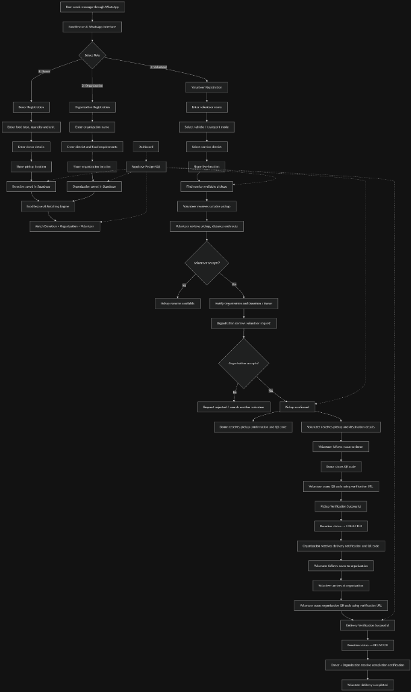

# AGENTS.md

Guidance for AI coding agents and developers working on the **FoodRescue AI** codebase.

---

## Project Overview

**FoodRescue AI** is an autonomous, AI-powered surplus food rescue and logistics coordination system. It connects Food Donors (restaurants, hotels, caterers, households) with Recipient Organizations (shelters, community kitchens, orphanages) and Volunteer Couriers (motorbikes, tuk-tuks, cars, vans, bicycles) in real time to rescue edible food before it spoils.

* **Primary User Interface:** WhatsApp (Meta WhatsApp Business Cloud API v24.0).
* **Monitoring & Administration:** Web Dashboard on Vercel ([https://foodrescue-ai-ten.vercel.app](https://foodrescue-ai-ten.vercel.app)).
* **Orchestration Framework:** Yaala Labs Agent Kernel (`agentkernel.adk.GoogleADKModule`).
* **LLM Engine:** Google Gemini (Google ADK) with resilient multi-model failover (`resilient_executor.py`).
* **Production Database:** Supabase PostgreSQL (`db_supabase.py`).

---

## Visual Workflow Reference

The canonical visual workflow for FoodRescue AI is defined in the attached workflow diagram:



---

## Source of Truth

* The **actual source code** in `use-cases/foodrescue/` is the single source of truth for all architectural and implementation decisions.
* Never assume past documentation is correct without verifying against the implementation files: `app.py`, `database.py`, `db_supabase.py`, `whatsapp_handler.py`, `resilient_executor.py`, `api_routes.py`, `qr_service.py`, `routing.py`, `routing_service.py`, and SQL migrations.
* Never change the established workflow or remove existing features without updating `SPEC.md`, `README.md`, and the automated test suite.

---

## Architecture Rules

1. **Keep Layers Decoupled:**
   * Ingress (`whatsapp_handler.py`, `api_routes.py`) → Agent Core (`app.py`, `tools.py`) → Resilient Executor (`resilient_executor.py`) → Persistence Layer (`database.py`, `db_supabase.py`).
   * Never import UI/transport modules directly into the persistence repository layer.
2. **Framework Alignment:**
   * Use Agent Kernel's native `Session`, `KeyValueCache`, `ChatService`, and `RESTAPI` conventions.
   * Do not invent intermediate wrapper abstractions when existing Agent Kernel classes already fulfill the contract.
3. **Resilient LLM Execution:**
   * All user-facing chat interactions must pass through `resilient_executor.py` to ensure automatic 429 quota rotation and deterministic rule fallback.

---

## Database Rules

1. **Supabase PostgreSQL is the Active Production Database:**
   * All production queries, transactions, and state storage must target Supabase PostgreSQL via `db_supabase.py`.
   * **MongoDB is NOT the production database.** Do not describe MongoDB as the production database, and do not reintroduce MongoDB as the default backend.
   * Local SQLite (`db_sqlite.py`) is reserved strictly for offline unit testing when `FOODRESCUE_DATABASE=sqlite`.
2. **Schema Integrity & Migrations:**
   * The canonical database schema is defined in `supabase/migrations/20260827000000_create_foodrescue_schema.sql` (13 tables: `donors`, `organizations`, `volunteers`, `donations`, `pickup_tasks`, `notifications`, `audit_events`, `reimbursements`, `pickup_location_history`, `users`, `messages`, `system_settings`, `qr_codes`).
   * Never modify the schema without checking existing migration SQL files and updating `db_supabase.py` and `db_sqlite.py` in lockstep.
   * All SQL queries must use parameterized placeholders (`%s` in PostgreSQL / `?` in SQLite) to eliminate SQL injection vulnerabilities.
3. **Permanent Deletions:**
   * Deleting a record (`donations`, `donors`, `organizations`, `volunteers`, `users`, `pickup_tasks`) must cascade or permanently remove the row. Deleted records must never reappear upon page refresh or subsequent queries.

---

## WhatsApp Rules

1. **Primary Communication Interface:**
   * WhatsApp is the main user-facing interface for all three roles.
   * Do not introduce unnecessary web-based user forms or workflows that bypass WhatsApp.
   * Ensure WhatsApp messages are formatted clearly using WhatsApp markdown (`*bold*`, `_italics_`, emoji bullet points).
   * Respect the 4,096 character limit for text messages by chunking when necessary.
2. **Webhook Idempotency:**
   * All incoming WhatsApp messages must pass through the `PROCESSED_MESSAGE_IDS` ring buffer and database dedup check to prevent duplicate execution from Meta webhook retries.
3. **Privacy & Security:**
   * Never echo raw WhatsApp API tokens, secrets, or internal database IDs in conversational replies.
   * Always verify `X-Hub-Signature-256` HMAC signatures on incoming webhook requests when `WHATSAPP_APP_SECRET` is configured.

---

## Role Isolation Rules

FoodRescue AI strictly separates the state and workflows of different user roles:

1. **Donor Isolation:** Donor state must never leak into organization or volunteer sessions. A donor user must only see and manage their own donations and pickup QR codes.
2. **Organization Isolation:** Organization state must never leak into donor or volunteer sessions. An organization user must only see incoming donation offers for their registered district and their own delivery QR codes.
3. **Volunteer Isolation:** Volunteer state must never leak into donor or organization sessions. A volunteer courier must only see offered or claimed pickup tasks, route directions, and their own reimbursement metrics.
4. **Session Keying:** Sessions must always be partitioned by normalized phone number: `whatsapp:<phone_number>`.

---

## Dynamic User Data Rules

1. **Never Hardcode User Input:**
   * **Food Type** must come strictly from user text or voice input. Never substitute default values like "Standard Meal" if the user specified a custom dish.
   * **Quantity & Unit** must be parsed directly from user input (e.g., "30 packets", "15 kg", "50 boxes").
   * **Donor / Organization / Volunteer Name** must be derived from user input or persistent user profile.
   * **District & Location** must be extracted from the user's message or GPS coordinates.
2. **Exact Field Preservation:**
   * Any detail provided by the user in turn 1 must be faithfully preserved in subsequent turns and recorded in the database without being overwritten by generic defaults.

---

## Conversation State Rules

1. **Zero-Repetition Rule:**
   * Check existing user profile (`get_user_profile`) and active draft (`get_draft_donation`) before asking questions.
   * Never ask the user for information they have already provided in the current or previous turns.
2. **Sequential Slot-Filling:**
   * For donor onboarding, prompt strictly for missing fields in order:
     `FOOD_TYPE` → `QUANTITY` → `DONOR_NAME` → `DISTRICT` → `DEADLINE` → `WHATSAPP_LOCATION` → `CONFIRMATION`.
3. **Language Persistence:**
   * Detect and store user language preference (`en`, `si`, `ta`) in `users.preferred_language`.
   * Continue responding in the selected language across all subsequent turns.

---

## QR Handover Rules

1. **Two Distinct QR Stages:**
   * **Stage 1 — Pickup QR (`FR-PK-...`):** Generated upon volunteer assignment. Displayed by the Donor. Scanned by the Volunteer. Verifies that the volunteer collected the food from the donor. Status transitions to `COLLECTED` / `IN_TRANSIT`.
   * **Stage 2 — Delivery QR (`FR-DL-...`):** Generated upon pickup confirmation. Displayed by the Organization. Scanned by the Volunteer. Verifies that the volunteer delivered the food to the organization. Status transitions to `DELIVERED` / `COMPLETED`.
2. **Cryptographic Security:**
   * QR tokens must use secure random tokens (`secrets.token_hex(6)`).
   * Token verification must be atomic and update `qr_codes.status='VERIFIED'` immediately to prevent replay attacks.

---

## Routing & Logistics Rules

1. **Real-World Distance & Travel Times:**
   * Use `routing_service.py` (GraphHopper Routing API) for real road distance and turn-by-turn geometry.
   * Fall back to `routing.py` (Haversine distance with 1.25x road curvature adjustment) when the routing API is unavailable or unconfigured.
2. **Sri Lanka Geographic Coverage:**
   * District resolution must validate against the 25 Sri Lankan administrative districts and the built-in `TOWN_TO_DISTRICT_MAP`.
3. **Dynamic Transport Reimbursement:**
   * Reimbursements must be calculated dynamically based on actual road distance and vehicle mode using configured rates in `system_settings`. Never hardcode fixed reimbursement values.

---

## Dashboard Rules

1. **Live Data Only:**
   * All metrics, tables, map markers, and message feeds on the dashboard ([https://foodrescue-ai-ten.vercel.app](https://foodrescue-ai-ten.vercel.app)) must reflect actual data from the backend / Supabase PostgreSQL database.
   * Never introduce static or fake mock data into dashboard API endpoints (`/api/dashboard`, `/api/stats`, `/api/live-operations`).
2. **Real-Time Synchronization:**
   * The dashboard polls the backend every 4 seconds to maintain real-time synchronization with WhatsApp activity.

---

## Performance Rules

1. **Sub-Second Response Targets:**
   * Keep WhatsApp response latency low by optimizing database queries and caching external API calls.
2. **Caching Strategy:**
   * In-memory 1-hour TTL caching for identical coordinate routing queries (`routing_service._ROUTE_CACHE`).
   * In-memory caching for generated QR PNG byte streams (`qr_service.QR_IMAGE_CACHE`).
3. **Connection Pooling:**
   * Maintain healthy connection pool keepalives with Supabase PostgreSQL to eliminate cold-start connection latency.

---

## Testing Rules

1. **Run Tests After Any Modification:**
   * Always run the pytest suite before considering any code change complete:
     ```bash
     .venv\Scripts\pytest.exe -q
     ```
     (or `pytest -q` on Linux/macOS).
2. **Maintain Full Test Passing Status:**
   * The test suite contains 348 tests across 30 test files. Ensure all tests pass (`344 passed, 4 skipped` due to missing optional cloud API keys in local environments).
3. **No Mock Creep:**
   * Unit test mocks must accurately mirror the behavior of production repository methods in `db_supabase.py`.

---


