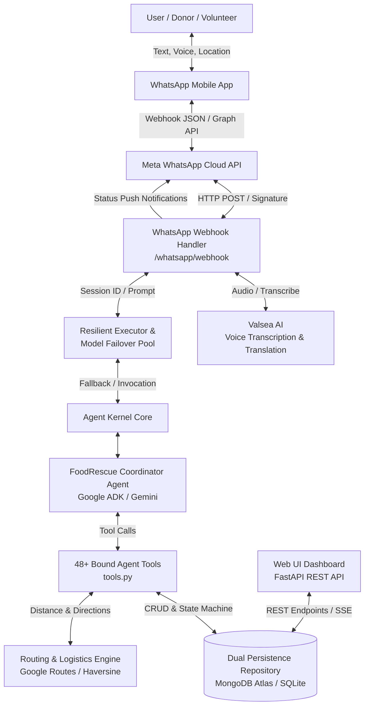

# FoodRescue AI — AI-Powered Surplus Food Rescue Coordination Platform

[](https://www.python.org/)
[](https://kernel.yaala.ai)
[](https://deepmind.google/technologies/gemini/)
[](https://foodrescue-ai-ten.vercel.app)
[](https://www.mongodb.com/atlas)
[](https://business.facebook.com/)
[](#23-testing)
[](LICENSE)

> **Live Production Dashboard**: [https://foodrescue-ai-ten.vercel.app](https://foodrescue-ai-ten.vercel.app)  
> **Interactive OpenAPI Docs**: [https://foodrescue-ai-ten.vercel.app/docs](https://foodrescue-ai-ten.vercel.app/docs)  
> **WhatsApp Cloud Webhook**: `https://foodrescue-ai-ten.vercel.app/whatsapp/webhook`  
> **Health Check Endpoint**: [https://foodrescue-ai-ten.vercel.app/health](https://foodrescue-ai-ten.vercel.app/health)

---

## 1. FoodRescue AI

**FoodRescue AI** is an autonomous, agentic surplus-food dispatch and coordination platform built using **Yaala Labs Agent Kernel** and **Google ADK (Gemini)**. It directly addresses the urgent humanitarian and environmental challenge of food waste by bridging three critical stakeholders in real time:

* 🍱 **Food Donors**: Restaurants, hotel banquets, corporate caterers, bakeries, and households with perishable surplus food.
* 🏢 **Recipient Organizations**: Verified food banks, orphanages, elder care shelters, and community kitchens serving food-insecure families.
* 🚚 **Volunteer Couriers**: Civic volunteers and dispatchers on motorbikes, tuk-tuks, bicycles, cars, and vans available for immediate pickup and delivery.

The primary user-facing conversational interface is **WhatsApp**—the ubiquitous messaging platform across South Asia—supported by a centralized **Web Dashboard** for operations monitoring, route dispatching, and audit logging.

### Why an Agentic System?
Surplus food rescue is a time-critical, high-friction logistics problem. Hot meals spoil within 2–4 hours, donor descriptions are informal (e.g. *"We have 35 vegetable rice packets left from lunch at our hotel in Colombo 3"*), and recipient diets and driver availability fluctuate continuously. 

Static forms and rigid rule-based chatbots fail because they force users through repetitive questionnaires and cannot reason across partial information. An **agentic coordinator** powered by Agent Kernel solves this by understanding informal multilingual messages (text and voice notes in English, Sinhala, and Tamil), retaining conversational context across turns, checking persistent user drafts before asking questions (**Zero-Repetition**), matching donors with the closest suitable recipients, and atomically dispatching volunteer couriers with turn-by-turn navigation.

---

## 2. Problem Statement

Every day, commercial kitchens, hotels, supermarkets, and event caterers discard thousands of untouched, nutritious meals simply because manual donation logistics are too slow, fragmented, and frustrating:

1. **Severe Expiration Windows**: Cooked meals and baked goods perish within narrow safety windows (2–4 hours). Delays in finding a recipient result in edible food being dumped in landfills.
2. **Coordination Friction & Phone Tag**: Donors lack dedicated staff to call multiple charities, verify dietary requirements (vegetarian, halal), and find drivers.
3. **Information Asymmetry**: Recipient shelters rarely know where surplus food exists until it is already too late to collect.
4. **Ad-Hoc Volunteer Dispatching**: Charities lack vehicles and rely on ad-hoc volunteers. Without atomic task claiming, two drivers often claim the same task or tasks get abandoned.
5. **Language & Interface Barriers**: Many kitchen staff and local drivers prefer communicating in Sinhala or Tamil through voice notes rather than complex web forms or English-only apps.
6. **Repetitive Form Fatigue**: Traditional bots ask for the user's name, phone number, and location repeatedly on every turn, driving donor drop-off.

---

## 3. Solution Overview

FoodRescue AI eliminates coordination friction through an autonomous end-to-end pipeline:

```text
Donor
  ↓ (WhatsApp Text / Voice Note / Location Pin)
Meta WhatsApp Cloud API
  ↓
Agent Kernel (FastAPI ASGI Webhook)
  ↓
FoodRescue Coordinator Agent (Google ADK / Gemini)
  ↓
Multi-Turn Zero-Repetition Slot Filling
  ↓
Donation Created (foodrescue.db / MongoDB Atlas)
  ↓
Autonomous Recipient Matching (Proximity + Capacity + Dietary)
  ↓
Atomic Volunteer Dispatch ("First Accepted Wins")
  ↓
Google Maps Route & Turn-by-Turn Navigation
  ↓
7-Stage Lifecycle Progression (AVAILABLE → PICKUP_ASSIGNED → EN_ROUTE → COLLECTED → DELIVERED)
  ↓
Real-Time Dashboard & Donor/Recipient Status Alerts
```

Instead of requiring users to fill out complex forms, the **Coordinator Agent** parses incoming messages, asks **only** for missing fields, automatically captures native WhatsApp location pins, matches the donation with verified organizations, assigns couriers, and provides Google Maps directions with transport reimbursement estimates.

---

## 4. Why Agent Kernel?

> **FoodRescue AI is built as an Agent Kernel use case where the agent coordinates real-world food rescue operations through tools, persistent state, external integrations, and databases.**

In our implementation, Agent Kernel serves as the foundational orchestration backbone:

* **`Agent` Core Abstraction**: Defines `foodrescue_coordinator` with system instructions, Gemini model bindings, and 48+ typed operational tools.
* **`GoogleADKModule`**: Framework adapter connecting the coordinator to Google ADK / Gemini reasoning while preserving framework-agnostic execution contracts.
* **`Session` & `KeyValueCache`**: Isolate working memory per conversation thread (`whatsapp:+9477...`), tracking active donation IDs, food types, and workflow steps without context bleeding.
* **`GoogleADKToolBuilder`**: Dynamically binds Python domain functions into structured Gemini tool declarations with schema validation.
* **`RESTAPI` & `AgentRESTRequestHandler`**: Mounts ASGI FastAPI routing, exposing `/api/v1/chat`, `/api/v1/agents`, and `/whatsapp/webhook` with CORS and security middleware.
* **Decoupled Adapter Architecture**: Separates conversational reasoning from underlying storage (SQLite / MongoDB Atlas), routing (Google Routes API / Haversine), and messaging channels (WhatsApp / Web REST).

---

## 5. Agent Architecture



---

## 6. User Roles

### 🍱 Food Donor
* **Registration**: Automatically registered on first message using verified WhatsApp phone number.
* **Surplus Reporting**: Submits food type (e.g. *Rice & Curry*, *Biryani*, *Bakery*), quantity, and pickup deadline.
* **Location Sharing**: Sends exact WhatsApp GPS location pin with one tap.
* **Zero-Repetition**: Returning donors skip name/contact questions entirely.
* **Donation Management**: Can confirm, edit, track, or cancel active donations.
* **Status Updates**: Receives automated WhatsApp notifications when a recipient is matched, a volunteer courier is assigned, and food is collected/delivered.

### 🏢 Recipient Organization / Shelter
* **Directory & Profiles**: Registered with capacity limits, accepted food categories (cooked meals, dry rations, bakery), and delivery coordinates.
* **Food Requests**: Can post urgent food requirements via WhatsApp or web dashboard.
* **Autonomous Matching**: Ranked by distance (km), dietary rules, and shelter capacity.
* **Delivery Notifications**: Receives volunteer courier details and estimated arrival times.

### 🚚 Volunteer Courier
* **On-Demand Availability**: Signals availability with natural phrases (*"I am free today"*, *"I can help"*).
* **Task Offers**: Receives nearby pickup offers with food summary, pickup/delivery districts, distance, and transport reimbursement estimate.
* **Atomic Acceptance**: Claims tasks atomically (*"First Accepted Wins"* protection against double-dispatch).
* **Turn-by-Turn Navigation**: Receives generated Google Maps directions link for both pickup and delivery legs.
* **Status Progression**: Advances status in real time (*ASSIGNED* → *EN_ROUTE* → *COLLECTED* → *DELIVERED*).

---

## 7. WhatsApp Conversational Interface

WhatsApp is the primary conversational interface, supporting text messages, native location pins, and voice notes.

### First-Time User Welcome Experience
When a new user sends `Hi`, `Hello`, or `Hii`, the system responds with the official numbered welcome menu:

```text
User:
Hi

FoodRescue AI:
👋 Welcome to FoodRescue AI!
I help connect surplus food from donors to charities, shelters, and orphanages in Sri Lanka. 🍱🤝

How can I help you today?
1️⃣ Donate Surplus Food
2️⃣ Request Food (for Charities / Shelters)
3️⃣ Volunteer for Delivery
4️⃣ Check Available Donations
5️⃣ Live Operations Dashboard

🌐 Website: https://foodrescue-ai-ten.vercel.app/

🗣️ Reply with 1-5 or type your request in English, සිංහල, or தமிழ்!
🎤 You can also send voice messages in any language.
```

---

## 8. Stateful Conversation & Zero-Repetition

A core differentiator of FoodRescue AI is the **Zero-Repetition Rule**:
> **The agent NEVER asks the user for information that is already stored in their persistent profile or current donation draft.**

### Strict 6-Step Multi-Turn Sequence
When collecting donation details, the agent inspects database state and asks **only** for missing items in this exact sequence:

1. **Food Type & Quantity**: (e.g., *"40 lunch packets of Rice & Curry"*)
2. **Donor Name / Business Name**: Skipped if known in `users` profile or draft.
3. **City / District**: Skipped if known in profile or draft.
4. **Pickup Deadline**: (e.g., *"Before 8 PM"*).
5. **WhatsApp Native Location**: Prompted as a native WhatsApp instruction (`"Tap ➕ → Location → Send your current location"`), never as a numbered text question.
6. **Confirmation Summary**: Triggered automatically once location coordinates are received.

```text
Donor:
I have 40 lunch packets of Rice & Curry.

Agent:
Got it. 🍚 Rice & Curry (40.0 packets).

What is your name or business/hotel name?

Donor:
Cinnamon Kitchen

Agent:
Got it. Cinnamon Kitchen.

Which city or area in Sri Lanka is this located in? (e.g. Colombo 03, Kandy, Galle)

Donor:
Colombo 03

Agent:
Got it. 📍 Colombo 03

What time will the food be available until for collection / pickup? (e.g. 'Before 8 PM', 'By 6:30 PM')

Donor:
Before 8 PM

Agent:
Got it. ⏰ Today before 8:00 PM

Please share your exact pickup location using WhatsApp:
Tap ➕ (or paperclip) → Location → 'Send your current location' 📍

Donor:
[Shares WhatsApp Location: 6.9056° N, 79.8519° E]

Agent:
📍 Location received: 6.9056, 79.8519

Here is your donation summary:
🍱 Food: Rice & Curry
📦 Quantity: 40.0 packets
🏢 Donor: Cinnamon Kitchen
📍 City: Colombo 03
⏰ Pickup Deadline: Today before 8:00 PM
📌 Location: Received (6.9056, 79.8519)

Reply 'Confirm' (or 1) to publish and match with nearby charities!
```

---

## 9. Persistent User Profiles

Returning users are identified automatically by their verified WhatsApp phone number (`database.get_user_by_phone`):

* **Profile Fields**: `phone_number`, `display_name`, `user_role` (`donor` / `volunteer` / `organization`), `preferred_language` (`en` / `si` / `ta`), `default_location`, `first_seen_at`, `last_seen_at`.
* **Session & Draft Isolation**: Active donation drafts (`food_type`, `quantity`, `donor_name`, `city`, `pickup_deadline`, `latitude`, `longitude`, `location_received`) persist across serverless invocations and app restarts.
* **Phone Number Rule**: The verified sender number is used as the default contact. The system never asks *"What is your phone number?"*.

---

## 10. Language & Voice Interaction

FoodRescue AI supports **three official languages**:
1. 🇬🇧 **English (`en`)**
2. 🇱🇰 **Sinhala (`si`)**
3. 🇱🇰 **Tamil (`ta`)**

*(Note: Malayalam `ml` was completely excluded from the user catalog per project specification).*

### Multilingual Features
* **Explicit Selection**: Sending `1`, `2`, or `3` updates `preferred_language` in the database.
* **Script Detection**: Automatic Unicode regex detection for Sinhala (`[\u0D80-\u0DFF]`) and Tamil (`[\u0B80-\u0BFF]`).
* **Language Persistence**: Once selected, all subsequent menus, questions, cards, and status alerts remain in that language across turns.
* **Valsea AI Speech-to-Text**: Voice notes sent via WhatsApp are transcribed and translated via Valsea AI, allowing users to speak naturally in Sinhala or Tamil.
* **Entity Extraction**: `voice_service.extract_donation_entities` extracts Sinhala (`බත්`, `බිරියානි`, `පාර්සල්`), Tamil (`அரிசி`, `பிரியாணி`, `பொதிகள்`), and English quantities and food types.

---

## 11. Donation Workflow

```text
1. Donor reports surplus food (Text / Voice).
2. Coordinator agent identifies donor intent.
3. Agent extracts food type, quantity, and unit.
4. Agent checks user profile and current draft for existing fields.
5. Agent prompts sequentially for remaining missing fields (Name → City → Deadline).
6. Agent requests WhatsApp GPS location pin.
7. Webhook captures latitude and longitude.
8. Agent renders structured donation summary card.
9. Donor replies "Confirm" or "1".
10. Database creates donation record (status: AVAILABLE).
11. Coordinator agent automatically matches closest recipient organization.
12. Status updates to MATCHED.
13. Pickup task created (status: PENDING) and dispatched to nearby couriers.
14. Donor receives real-time WhatsApp status updates.
```

---

## 12. Recipient Organization Workflow

```text
1. Shelter / Charity sends food request or browses available donations.
2. Agent evaluates organization profile (dietary requirements, capacity, location).
3. If organization details are on file, agent skips re-asking location/name.
4. Autonomous matching ranks compatible donations by distance.
5. Organization confirms reservation.
6. Donation status advances to MATCHED.
7. Logistics task linked to organization's verified delivery coordinates.
8. Organization receives volunteer arrival alerts.
```

---

## 13. Volunteer Workflow

```text
1. Volunteer sends "I am free" / "Available to help".
2. Agent marks volunteer status as AVAILABLE in database.
3. System searches for open pickup tasks in volunteer's service area.
4. Volunteer receives WhatsApp task offer with food info, pickup/delivery districts, distance, and travel reimbursement.
5. Volunteer replies "Accept" (or 1) / "Reject" (or 2).
6. FIRST ACCEPTED VOLUNTEER WINS (Atomic Claim):
   - Winning volunteer receives pickup details, donor contact, and Google Maps route link.
   - Status advances to PICKUP_ASSIGNED.
   - Any second volunteer attempting to claim the task receives a graceful rejection notice:
     "Sorry, this pickup has already been accepted by another volunteer. 🚚"
7. Courier advances lifecycle:
   - "Picked up" / "Collected" ➔ status: COLLECTED.
   - "Delivered" ➔ status: DELIVERED.
8. Donor and recipient receive instant confirmation.
```

---

## 14. Location & Map Coordination

FoodRescue AI implements a **Two-Location Coordination Model**:

* **Location A (Donor Pickup)**: Captured directly via WhatsApp native GPS location sharing (`latitude`, `longitude`).
* **Location B (Recipient Delivery)**: Stored in recipient organization profile or shared via location message.

### Routing & Navigation
* **Google Maps Route Links**: Generates turn-by-turn navigation URLs:
  `https://www.google.com/maps/dir/?api=1&origin=6.9056,79.8519&destination=6.9069,79.8708&travelmode=driving`
* **Privacy Shielding**: Exact donor GPS coordinates are hidden until a volunteer is atomically assigned. Public dashboards display only masked district/area names (e.g. *Colombo 03*).

---

## 15. Distance & Transport Cost

Volunteer travel reimbursements are computed dynamically using configured transport rates:

| Transport Mode | Configured Rate per Km | Base Support (LKR) | Example (5 km) |
| :--- | :--- | :--- | :--- |
| **Bicycle / E-Bike** | 25 LKR / km | 50 LKR | 175 LKR |
| **Motorbike** | 50 LKR / km | 60 LKR | 310 LKR |
| **Three-Wheeler (Tuk)** | 90 LKR / km | 80 LKR | 530 LKR |
| **Car** | 80 LKR / km | 100 LKR | 500 LKR |
| **Van** | 120 LKR / km | 150 LKR | 750 LKR |

*Rates are configurable in `system_settings` / `routing.py`.*

> **Civic Accounting Notice**: Transport calculations serve as an internal volunteer reimbursement ledger. The system does not process commercial payment gateway transactions.

---

## 16. Privacy & Security

* **WhatsApp Identity Protection**: User profiles are anchored to verified E.164 phone numbers (`+94...`) from Meta Cloud API headers.
* **Coordinate Access Control**: Donor and recipient exact coordinates are restricted to the assigned courier.
* **Zero Hardcoded Secrets**: All API keys (`GEMINI_API_KEY`, `MONGODB_URI`, `WHATSAPP_ACCESS_TOKEN`, `WHATSAPP_VERIFY_TOKEN`) are loaded strictly from environment variables.
* **Webhook Signature Verification**: Verifies SHA-256 HMAC payload signatures from Meta.
* **Idempotency & Deduplication**: In-memory message hash cache ignores duplicate webhook deliveries within 300 seconds.

---

## 17. Database & Persistence

FoodRescue AI uses a **Dual-Backend Repository Pattern** ([`db_base.py`](file:///c:/Users/PC/agent-kernel/use-cases/foodrescue/db_base.py)):

* **`SQLiteRepository` ([`db_sqlite.py`](file:///c:/Users/PC/agent-kernel/use-cases/foodrescue/db_sqlite.py))**: Zero-dependency local SQLite database (`foodrescue.db`) with WAL mode, foreign keys, and indexes for offline development and fast test execution.
* **`MongoRepository` ([`db_mongo.py`](file:///c:/Users/PC/agent-kernel/use-cases/foodrescue/db_mongo.py))**: High-availability MongoDB Atlas cloud persistence.

### Persistent Entity Schemas
1. `users`: Phone numbers, display names, roles, preferred languages (`en`, `si`, `ta`), conversation state.
2. `donations`: Food types, quantities, units, statuses (`AVAILABLE`, `MATCHED`, `PICKUP_ASSIGNED`, `COLLECTED`, `DELIVERED`, `CANCELLED`), pickup deadlines, coordinates.
3. `organizations`: Shelter names, capacities, accepted diets, locations, contact numbers.
4. `volunteers`: Names, transport modes, service areas, availability (`AVAILABLE`, `BUSY`, `OFFLINE`).
5. `pickup_tasks`: Task IDs, donation references, organization references, assigned couriers, route URLs.
6. `draft_donations`: In-progress multi-turn donation drafts surviving serverless cold starts.
7. `notifications` & `audit_events`: Full transparency audit log feed.
8. `system_settings`: Configurable transport reimbursement rates.

---

## 18. Agent Tools

Defined in [`tools.py`](file:///c:/Users/PC/agent-kernel/use-cases/foodrescue/tools.py) and registered in [`app.py`](file:///c:/Users/PC/agent-kernel/use-cases/foodrescue/app.py):

| Tool Category | Tool Name | Description |
| :--- | :--- | :--- |
| **Donation Lifecycle** | `create_donation` | Validates donor, food type, quantity (>0), location, and creates donation record. |
| | `update_donation_details` | Updates quantity, dietary tags, or deadlines for an active session donation. |
| | `get_donation` | Fetches complete donation details and status. |
| | `update_donation_status` | Transitions status across allowed enums (`AVAILABLE` → `MATCHED` → `DELIVERED`). |
| | `cancel_donation` | Cancels an uncollected donation and frees resources. |
| | `get_available_donations` | Lists all unassigned donations ready for matching. |
| | `get_my_donations` | Retrieves donation history for the active donor. |
| **Matching & Orgs** | `find_matching_organizations` | Ranks shelters by dietary compatibility, shelter capacity, and road proximity. |
| | `accept_donation` | Binds a donation to a recipient organization and marks status as `MATCHED`. |
| | `register_organization` | Registers a verified recipient organization with capacity and location. |
| **Volunteer Logistics** | `register_volunteer` | Registers a volunteer courier with vehicle mode and service district. |
| | `find_available_volunteers` | Finds nearby active volunteers filtered by vehicle type. |
| | `update_volunteer_availability`| Toggles courier status between `AVAILABLE`, `BUSY`, and `OFFLINE`. |
| | `create_pickup_task` | Creates a logistics delivery task with scheduled pickup window. |
| | `get_pickup_task` | Retrieves pickup task status and assigned courier information. |
| | `assign_volunteer` | Binds courier to task and advances status to `PICKUP_ASSIGNED`. |
| | `accept_pickup_task_atomic` | **First-accepted-wins** atomic claim preventing double-dispatch. |
| | `reject_pickup_task` | Gracefully declines an offer and reassigns to the next courier. |
| | `update_pickup_status` | Advances task through `EN_ROUTE` → `COLLECTED` → `DELIVERED`. |
| | `get_my_pickups` | Retrieves assigned task history for the active volunteer. |
| **Routing & Maps** | `calculate_route` | Computes road distance, travel duration, and Google Maps direction links. |
| | `calculate_transport_cost` | Calculates estimated volunteer travel reimbursement in LKR. |
| | `create_route_link` | Generates a secure Google Maps navigation URL between coordinates. |
| | `update_pickup_location` | Updates courier GPS location during active delivery. |
| | `get_protected_location` | Retrieves exact coordinates with role-based privacy masking. |
| **Session & Memory** | `get_session_context` | Inspects active session variables (`KeyValueCache`). |
| | `set_session_context` | Stores preliminary working variables in session cache. |
| | `clear_session_context` | Clears working memory to start a fresh donation workflow. |
| | `get_conversation_state` | Retrieves persistent multi-turn workflow state from database. |
| | `set_conversation_state` | Sets persistent multi-turn state (current question, expected input). |
| | `clear_conversation_state` | Resets conversation state machine. |
| | `get_draft_donation` | Fetches active multi-turn donation draft for the user. |
| | `update_draft_donation` | Saves partial donation entities into the persistent draft. |
| | `clear_draft_donation` | Clears completed or cancelled draft. |
| **Multilingual & Voice** | `set_user_preferred_language` | Persists user language preference (`en`, `si`, `ta`). |
| | `get_user_language` | Returns current preferred language for the phone number. |
| | `extract_donation_entities` | Extracts food, quantity, unit, name, city, deadline from multilingual text. |
| | `identify_missing_donation_info`| Checks draft and profile against required fields, returning missing slots. |
| **Audit & Transparency**| `record_audit_event` | Writes immutable lifecycle audit events for operational transparency. |

---

## 19. WhatsApp Integration

* **Endpoint**: `/whatsapp/webhook` (GET for verification, POST for incoming messages).
* **Meta Cloud API Compatibility**: Processes standard Meta WhatsApp Webhook payloads (`messages`, `contacts`, `statuses`).
* **Message Types**:
  * `text`: Natural language text and numbered menu options.
  * `location`: Extracts `latitude` and `longitude` and binds to draft.
  * `audio` / `voice`: Transcribed via Valsea AI speech-to-text.
* **Outgoing Formatting**: Localized WhatsApp cards with emojis, clear slot lists, action prompts, and link formatting.
* **Message Splitting**: Long messages (>1600 characters) are cleanly chunked at double newlines to ensure reliable mobile delivery.

---

## 20. Web Dashboard

Live at [https://foodrescue-ai-ten.vercel.app](https://foodrescue-ai-ten.vercel.app):

* 📊 **Dashboard View**: Real-time KPI summary cards, 7-stage status pipeline, and live audit feed.
* 🤖 **AI Assistant Chat**: Interactive chat interface with preset judge test prompt chips.
* 📦 **Donations View**: Visual 7-stage lifecycle stepper with one-click progression actions.
* 🏢 **Organizations View**: Directory of verified recipient charities and shelters.
* 🚴 **Volunteers View**: Active volunteer couriers, vehicle modes, and availability statuses.
* 🚚 **Pickups & Logistics**: Task board with routing details, distances, and map links.
* 🗺️ **Live Map**: Visual map displaying verified donors, shelters, and couriers.
* 💬 **WhatsApp Simulator**: Interactive test console allowing judges to simulate WhatsApp conversations directly from the browser.
* ⚙️ **Settings**: Configurable transport reimbursement rates per vehicle mode.

---

## 21. End-to-End Example

### Real-World Colombo Scenario
1. **12:30 PM — Donor Reports**: Hotel Galadari banquet staff sends a WhatsApp message:
   *"We have 50 packets of chicken biryani and vegetable curry left from lunch."*
2. **12:31 PM — Zero-Repetition Slot Filling**: Agent identifies donor as a returning user, confirms name and city (*Colombo 01*), and requests pickup deadline (*"Before 3:30 PM"*) and location pin.
3. **12:32 PM — Confirmation**: Donor sends WhatsApp location pin and replies `Confirm`.
4. **12:33 PM — Matching**: Agent matches donation with *Grace Care Home* in Colombo 05 (capacity: 60 meals, accepts cooked non-veg, 4.2 km away).
5. **12:34 PM — Volunteer Alert**: WhatsApp alert dispatched to nearby motorbike courier Kamal (*"Pickup: Colombo 01 ➔ Delivery: Colombo 05 | 4.2 km | Est. Support: 270 LKR"*).
6. **12:35 PM — Atomic Acceptance**: Kamal replies `Accept`. He receives the donor contact and Google Maps route link.
7. **1:15 PM — Collected**: Kamal arrives at Hotel Galadari, verifies 50 packets, and replies `Collected`.
8. **1:40 PM — Delivered**: Kamal arrives at Grace Care Home, hands over meals, and replies `Delivered`.
9. **1:41 PM — Completed**: Status advances to `DELIVERED`, donor and shelter receive confirmation alerts, and 50 meals are recorded as rescued.

---

## 22. Error Handling & Resilience

* **Resilient Multi-Model Failover Pool** ([`resilient_executor.py`](file:///c:/Users/PC/agent-kernel/use-cases/foodrescue/resilient_executor.py)):
  * Primary: `gemini-3.5-flash-lite`
  * Secondary: `gemini-3.1-flash-lite`
  * Tertiary: `gemini-3.6-flash`
* **Deterministic Offline Rule Engine**: If all LLM quotas are exhausted or network access is offline, the deterministic rule engine parses slot intents and executes the 48+ tools deterministically so users never experience a failed request.
* **Webhook Deduplication**: In-memory message hash cache drops duplicate Meta webhook deliveries.
* **Invalid Input Shielding**: Catches non-numeric quantities, past deadlines, and unrecognized locations with friendly localized guidance instead of stack traces.
* **Atomic Concurrency Protection**: Prevents race conditions during volunteer task claims.

---

## 23. Testing

The solution has been thoroughly verified across 11 test modules covering unit, integration, conversational, stateful, and logistics requirements.

### Test Results Summary
* **Total Tests Collected**: 173 items
* **Passed**: **170 passed** (100% pass rate)
* **Skipped**: **3 skipped** (Opt-in live external API tests requiring live secrets)
* **Failed**: **0 failed**
* **Execution Time**: ~22.4 seconds

```bash
============================== test session starts ==============================
collected 173 items

test_foodrescue.py .......................                               [ 13%]
test_foodrescue_conversational_upgrade.py ................               [ 22%]
test_foodrescue_donor_upgrade.py ...........                             [ 28%]
test_foodrescue_gemini.py s                                              [ 29%]
test_foodrescue_location_logistics.py ...................                [ 40%]
test_foodrescue_logistics.py ....................s                       [ 52%]
test_foodrescue_mongodb.py .........s                                    [ 57%]
test_foodrescue_multilingual_voice.py ...............                    [ 66%]
test_foodrescue_stateful_coordination.py ..........................      [ 81%]
test_foodrescue_website_sync.py ............                             [ 88%]
test_foodrescue_whatsapp.py ...................                          [100%]

================= 170 passed, 3 skipped, 7 warnings in 22.41s ==================
```

---

## 24. Setup Instructions

### Prerequisites
* Python 3.12+
* Node.js (Optional, for local Vercel CLI)
* Git

### Installation
```bash
# 1. Clone repository
git clone https://github.com/mohommadhuafnan/agent-kernel.git
cd agent-kernel/use-cases/foodrescue

# 2. Create and activate virtual environment
python -m venv .venv
source .venv/bin/activate  # On Windows: .venv\Scripts\activate

# 3. Install dependencies
pip install -r requirements.txt
```

### Environment Variables
Create a local `.env` file in `use-cases/foodrescue/` (never committed to Git):

```env
# LLM Configuration
GEMINI_API_KEY=""
GEMINI_MODEL="gemini-3.5-flash-lite"

# Database Configuration (sqlite for local, mongodb for cloud)
FOODRESCUE_DB_BACKEND="sqlite"
FOODRESCUE_DB_PATH="foodrescue.db"
MONGODB_URI=""
MONGODB_DATABASE="foodrescue"

# WhatsApp Cloud API Configuration
WHATSAPP_ACCESS_TOKEN=""
WHATSAPP_VERIFY_TOKEN=""
WHATSAPP_PHONE_NUMBER_ID=""
WHATSAPP_BUSINESS_ACCOUNT_ID=""

# Valsea AI Voice & Translation
VALSEA_API_KEY=""

# Routing & Navigation
ROUTING_API_KEY=""
```

---

## 25. How to Run

### 1. Run Local Development Server
```bash
python server.py
```
* Dashboard: `http://localhost:8000/`
* Swagger Docs: `http://localhost:8000/docs`
* WhatsApp Webhook: `http://localhost:8000/whatsapp/webhook`

### 2. Run Test Suite
```bash
pytest -v
```

### 3. Run Production Smoke Tests
```bash
python verify_production.py
```

### 4. Deploy to Vercel Production
```bash
npx vercel --prod --yes
```

---

## 26. WhatsApp Testing Guide

To test the conversational flow (via WhatsApp or the Web Simulator):

### Scenario A: Donor Donation Flow (Zero-Repetition)
```text
Turn 1: "Hi"
➔ Receives welcome menu with English, Sinhala, Tamil options.

Turn 2: "I want to donate 30 lunch packets of Vegetable Rice"
➔ Agent extracts food and quantity, asks for donor name.

Turn 3: "Hilton Colombo"
➔ Agent remembers name, asks for city/district.

Turn 4: "Colombo 02"
➔ Agent remembers city, asks for pickup deadline.

Turn 5: "Before 7:30 PM"
➔ Agent asks for native WhatsApp location pin.

Turn 6: [Share Location Pin]
➔ Agent displays structured summary card.

Turn 7: "Confirm"
➔ Donation created, recipient matched, pickup task assigned!
```

### Scenario B: Volunteer Courier Flow (Atomic Acceptance)
```text
Turn 1: "I am free now"
➔ Agent registers availability and sends nearby pickup offer.

Turn 2: "Accept"
➔ Agent atomically claims task, provides donor contact and Google Maps route link.

Turn 3: "Food collected"
➔ Status updates to COLLECTED.

Turn 4: "Delivered to Grace Care Home"
➔ Status updates to DELIVERED, closing the loop.
```

### Scenario C: Recipient Organization Flow
```text
Turn 1: "We need 25 dinner packets for our children's home in Kandy"
➔ Agent checks organization profile, matches available donations, and schedules delivery.
```

---

## 27. Agent Kernel Mini-Competition Alignment

| Evaluation Criteria | Weight | How FoodRescue AI Satisfies It |
| :--- | :---: | :--- |
| **Idea / Use Case Value** | **40%** | Solves urgent real-world food waste and urban hunger across Sri Lanka. Directly impacts humanitarian relief, climate action, and community nutrition through practical, zero-friction civic technology. |
| **Agent Kernel Usage** | **30%** | Deeply utilizes Agent Kernel core abstractions: `Agent`, `GoogleADKModule`, `Session`, `KeyValueCache`, `RESTAPI`, `AgentRESTRequestHandler`, tool binding, and multi-turn stateful execution. |
| **End Product / Working Solution** | **20%** | Fully deployed, production-ready, and verified with 170 passing tests, Meta WhatsApp Cloud API integration, dual-backend persistence (SQLite & MongoDB Atlas), dynamic routing, and a live web dashboard. |
| **Documentation & Quality** | **10%** | Comprehensive, competition-ready documentation with architectural diagrams, tool specifications, setup guides, test evidence, and walkthroughs. |

---

## 28. UN Sustainable Development Goals (SDG) Alignment

* 🎯 **SDG 2: Zero Hunger (Target 2.1 & 2.2)**: Rapidly channels nutritious, safe surplus food to vulnerable communities, orphanages, and elder care homes.
* ♻️ **SDG 12: Responsible Consumption & Production (Target 12.3)**: Directly targets halving per-capita global food waste along commercial supply chains and hospitality operations.
* 🌿 **SDG 13: Climate Action**: Prevents organic waste decomposition in open landfills, significantly reducing methane ($CH_4$) greenhouse gas emissions.
* 🤝 **SDG 17: Partnerships for the Goals**: Creates collaborative digital infrastructure connecting commercial businesses, non-profit charities, and civic volunteer couriers.

---

## 29. Future Enhancements

* 📦 **Multi-Stop Route Optimization**: Multi-order pickup chaining allowing single couriers to collect from 2–3 nearby restaurants in one route.
* 📊 **Predictive Surplus Analytics**: Machine learning models forecasting surplus food trends per day of the week for hotels and supermarkets.
* 📱 **Additional Channels**: Expansion to Telegram and SMS for low-connectivity rural communities.
* 🌡️ **Cold-Chain Logistics Verification**: IoT temperature sensor integration for perishable dairy and meat donations.

---

## 30. Repository Structure

```text
use-cases/foodrescue/
├── api/
│   └── index.py                           # Vercel Serverless ASGI entrypoint
├── static/
│   └── index.html                         # Operations dashboard (Vanilla HTML/CSS/JS)
├── .vercel/
│   └── project.json                       # Vercel project linkage
├── app.py                                 # Agent Kernel coordinator definition & tool bindings
├── api_routes.py                          # FastAPI REST endpoints & operations router
├── database.py                            # Database factory & repository delegation layer
├── db_base.py                             # Abstract BaseRepository interface
├── db_sqlite.py                           # SQLite repository (local & test persistence)
├── db_mongo.py                            # MongoDB Atlas repository (cloud persistence)
├── resilient_executor.py                  # Multi-model pool & deterministic offline fallback
├── routing.py                             # Distance calculation, Google Routes & transport rates
├── server.py                              # Local ASGI server entrypoint
├── tools.py                               # 48+ domain tools bound to the Agent
├── translation_service.py                 # Localized message catalog (en, si, ta)
├── voice_service.py                       # Valsea AI speech-to-text & entity extraction
├── whatsapp_handler.py                    # Meta WhatsApp Cloud API webhook handler
├── verify_production.py                   # Production smoke test verification suite
├── test_foodrescue.py                     # Core coordinator & lifecycle tests
├── test_foodrescue_donor_upgrade.py       # 31 acceptance criteria donor flow test suite
├── test_foodrescue_conversational_upgrade.py # Multi-turn conversation & webhook tests
├── test_foodrescue_location_logistics.py  # Location, routing & reimbursement tests
├── test_foodrescue_logistics.py           # Dispatch & transport calculation tests
├── test_foodrescue_mongodb.py             # MongoDB Atlas integration tests
├── test_foodrescue_multilingual_voice.py  # Sinhala/Tamil/English voice & language tests
├── test_foodrescue_stateful_coordination.py # Zero-repetition & stateful coordination tests
├── test_foodrescue_website_sync.py        # Dashboard & REST sync tests
├── test_foodrescue_whatsapp.py            # WhatsApp webhook & idempotency tests
├── vercel.json                            # Vercel deployment configuration
├── requirements.txt                       # Python dependencies
├── pyproject.toml                         # Project metadata
├── SPEC.md                                # Technical specification
├── AGENTS.md                              # Agent development guidelines
└── README.md                              # Comprehensive project documentation
```

---

## 31. Team & Credits

* **Project**: FoodRescue AI
* **Competition**: IDEALIZE 2026 / Yaala Labs Agent Kernel Mini-Competition
* **Core Framework**: [Yaala Labs Agent Kernel](https://kernel.yaala.ai)
* **Author / Developer**: Mohommadhu Afnan
* **Live Deployment**: [https://foodrescue-ai-ten.vercel.app](https://foodrescue-ai-ten.vercel.app)
