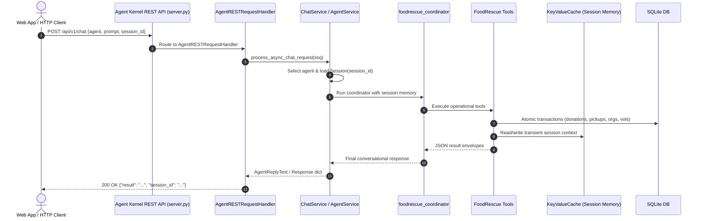

# FoodRescue AI Specification

## 1. Project Overview

FoodRescue AI is an agentic food-rescue coordination system that helps restaurants, hotels, supermarkets, event organizers, community organizations, and volunteers coordinate usable surplus food donations.

The system uses Agent Kernel to understand natural-language requests, invoke operational tools, maintain conversation context, and coordinate donation, recipient matching, and pickup workflows.

The project is designed as a practical real-world solution addressing:

- SDG 2: Zero Hunger
- SDG 12: Responsible Consumption and Production

## 2. Problem Statement

Usable surplus food is often difficult to coordinate quickly between food donors and organizations that can distribute it.

The problem is not simply discovering available food. The system must understand a donation, record it, identify suitable recipient organizations, identify available volunteers, create a pickup task, and communicate the resulting status.

FoodRescue AI automates this coordination through an Agent Kernel-powered assistant.

## 3. Primary Users

### Food Donors

Examples:

- Restaurants
- Hotels
- Supermarkets
- Bakeries
- Event organizers

They can report available surplus food.

### Recipient Organizations

Examples:

- Community kitchens
- Charitable organizations
- Food banks
- Community centers

They can receive and accept suitable donations.

### Volunteers

Volunteers can become available for pickup and delivery tasks.

### Administrators

Administrators can inspect donations, organizations, volunteers, and pickup status.

## 4. Primary Agent

Create one primary Agent Kernel agent:

`foodrescue_coordinator`

The coordinator is responsible for:

- Understanding donor requests
- Extracting donation information
- Selecting the appropriate tool
- Creating and updating donation records
- Finding suitable recipient organizations
- Finding available volunteers
- Creating pickup tasks
- Reporting status
- Maintaining useful session context

The first version should use one coordinator agent with multiple tools.

The architecture should remain extensible so specialized agents can be introduced later if they provide meaningful value.

## 5. Core User Flow

A donor can send a natural-language request such as:

"I have 40 vegetarian meal boxes available in Colombo. They need to be collected before 7 PM."

The system must:

1. Parse the donation details.
2. Validate the required information.
3. Save the donation.
4. Search for eligible recipient organizations.
5. Match the donation with a suitable organization.
6. Search for available volunteers.
7. Create a pickup task.
8. Update the donation status.
9. Return a concise summary to the donor.

Example lifecycle:

`AVAILABLE -> MATCHED -> PICKUP_ASSIGNED -> COLLECTED -> DELIVERED`

The system must support failure states such as:

`CANCELLED`

and

`EXPIRED`

## 6. Required Agent Tools

Create Agent Kernel tools for the following capabilities.

### Donation Management

`create_donation`

Create a new donation record.

Inputs:

- donor_id
- food_type
- quantity
- unit
- dietary_information
- location
- available_from
- pickup_deadline

`get_donation`

Retrieve a donation by ID.

`update_donation_status`

Update the donation lifecycle status.

### Recipient Matching

`find_matching_organizations`

Search organizations using:

- food type
- dietary compatibility
- quantity/capacity
- geographic/service area
- availability

Return ranked candidates.

`accept_donation`

Record that an organization has accepted a donation.

### Volunteer Matching

`find_available_volunteers`

Search volunteers using:

- availability
- geographic proximity/service area
- current status

`assign_volunteer`

Assign a volunteer to a pickup task.

### Pickup Management

`create_pickup_task`

Create a pickup/delivery task.

`get_pickup_task`

Retrieve pickup information.

`update_pickup_status`

Update pickup status:

- ASSIGNED
- EN_ROUTE
- COLLECTED
- DELIVERED
- FAILED
- CANCELLED

### Notification

Create a notification service abstraction.

The first local version may log notifications to the console.

The production version will support the selected messaging integration.

## 7. Local Database

Use SQLite for local development and testing.

The application must keep the data-access layer separate from the agent/tool layer.

Required tables:

### donors

- id
- name
- phone
- organization_name
- location
- created_at

### organizations

- id
- name
- phone
- service_area
- accepted_food_types
- capacity
- availability
- location
- created_at

### volunteers

- id
- name
- phone
- service_area
- availability
- current_status
- location
- created_at

### donations

- id
- donor_id
- food_type
- quantity
- unit
- dietary_information
- pickup_location
- available_from
- pickup_deadline
- status
- created_at
- updated_at

### pickup_tasks

- id
- donation_id
- organization_id
- volunteer_id
- pickup_location
- delivery_location
- scheduled_time
- status
- created_at
- updated_at

### notifications

- id
- recipient_type
- recipient_id
- message
- channel
- status
- created_at

Use SQLite during local development.

Do not make the Agent directly responsible for SQL statements. Database access should be implemented through repository/service functions exposed to the Agent Kernel tools.

## 8. Production Persistence

Production persistence should use AWS DynamoDB.

The database abstraction must allow the local implementation to use SQLite while production uses DynamoDB without changing agent business logic.

Business logic must not directly depend on SQLite-specific code.

## 9. Agent Session Memory

FoodRescue AI leverages Agent Kernel's native `Session` and `KeyValueCache` (`session.get_non_volatile_cache()`, `ToolContext.get().session`) for stateful conversational working memory across multi-turn interactions.

### Architecture & Separation of Concerns

- **SQLite Database**: The strict, permanent single source of truth for all business records (`donations`, `pickup_tasks`, `organizations`, `volunteers`, `notifications`).
- **Session Memory**: Transient conversational working memory attached to the active user `Session`. It tracks in-flight interaction context so donors do not need to repeat details across conversational turns.

### Tracked Session Context Keys

| Key | Type | Purpose |
| --- | --- | --- |
| `current_donor_id` | `str` | Active donor ID (e.g. `'d1'`) |
| `current_donation_id` | `str` | Active donation record ID (e.g. `'don-f950eb69'`) |
| `current_food_type` | `str` | Food category / description |
| `current_quantity` | `float` | Quantity of food items |
| `current_unit` | `str` | Unit of measure (e.g. `'boxes'`, `'kg'`) |
| `current_dietary_information` | `str` | Dietary specifics (e.g. `'Vegetarian'`, `'Halal'`) |
| `current_location` | `str` | Pickup geographic area / address |
| `current_available_from` | `str` | Ready timestamp / window |
| `current_pickup_deadline` | `str` | Latest pickup deadline |
| `current_organization_id` | `str` | Matched recipient organization ID |
| `current_task_id` | `str` | Created pickup task ID |
| `current_volunteer_id` | `str` | Assigned volunteer ID |
| `workflow_step` | `str` | Current lifecycle step (`DONATION_CREATED`, `ORGANIZATION_MATCHED`, `VOLUNTEER_ASSIGNED`, `PICKUP_DELIVERED`) |

### Multi-Turn Conversational Semantics

1. **Incremental Updates**: When a donor provides incremental information in subsequent turns (e.g., Turn 1: *"I have 40 vegetarian meal boxes in Colombo"*, Turn 2: *"They need to be collected before 7 PM"*), the agent uses `update_donation_details` to update the active donation without creating duplicate records.
2. **Contextual Fallbacks**: Tools automatically resolve active parameters (`donation_id`, `task_id`, `location`, `food_type`) from session context when omitted by the user.
3. **Session Inspection & Reset**: The agent can inspect state via `get_session_context()` or reset state via `clear_session_context()`. Clearing session memory does not affect persistent database records.


## 10. Local User Interface

Provide a local CLI entry point for development and testing.

The CLI allows a developer to enter natural-language requests interactively:

```text
FoodRescue > I have 40 vegetarian meal boxes available in Colombo until 7 PM.
```

CLI execution:
```powershell
python app.py
```

## 11. Agent Kernel REST API Specification (Phase 3)

Agent Kernel's built-in `RESTAPI` serves as the primary backend interface for FoodRescue AI, connecting frontend clients (such as the upcoming Web App) to the `foodrescue_coordinator` agent.

### Architecture & Routing



### Endpoints

#### 1. `GET /health`
- **Description**: Health check endpoint confirming the server is online and healthy.
- **Response**: `200 OK`
```json
{
  "status": "ok"
}
```

#### 2. `GET /api/v1/agents`
- **Description**: Lists all registered agents in the Agent Kernel runtime.
- **Response**: `200 OK`
```json
{
  "agents": ["foodrescue_coordinator"]
}
```

#### 3. `POST /api/v1/chat`
- **Description**: Executes a conversational request against the `foodrescue_coordinator` agent with stateful session continuity.
- **Request Headers**: `Content-Type: application/json`
- **Request Body**:
```json
{
  "agent": "foodrescue_coordinator",
  "prompt": "I am donor d1. I have 40 vegetarian meal boxes in Colombo 3.",
  "session_id": "session-12345"
}
```
- **Response**: `200 OK`
```json
{
  "result": "Created donation don-f950eb69...",
  "session_id": "session-12345"
}
```

### Multi-Turn Session Continuity
- Repeated requests containing the same `session_id` reuse the same Agent Kernel `Session` and `KeyValueCache`.
- Transient context (`current_donation_id`, `current_location`, `current_food_type`, `current_quantity`, `current_unit`, `current_pickup_deadline`, `current_organization_id`, `current_task_id`, `current_volunteer_id`) is preserved across turns without requiring the user to re-state IDs or previously provided details:
  - **Turn 1 (`session_id: "s1"`)**: *"I have 40 vegetarian meal boxes in Colombo"* $\rightarrow$ creates donation `don-xxxx` and remembers active donation and location.
  - **Turn 2 (`session_id: "s1"`)**: *"They need to be collected before 7 PM"* $\rightarrow$ updates active donation deadline without re-asking for donation ID.
  - **Turn 3 (`session_id: "s1"`)**: *"Find a volunteer and schedule pickup"* $\rightarrow$ resolves active donation, matches recipient, creates pickup task, and assigns volunteer.

### Error Handling & Validation
- **Missing `session_id`**: Returns `400 Bad Request` with `{"detail": {"error": "No session_id is provided in the request"}}`.
- **Missing `prompt`**: Returns `422 Unprocessable Entity` (Pydantic validation failure).
- **Unknown Agent**: Defaults to first registered agent (`foodrescue_coordinator`) or logs warning.

### Configuration Environment Variables

| Variable | Description | Required |
| --- | --- | --- |
| `GEMINI_API_KEY` | Gemini API Key for Coordinator LLM | Yes (Live mode) |
| `FOODRESCUE_DB_BACKEND` | Persistence backend: `sqlite` (default) or `mongodb` | Optional |
| `FOODRESCUE_DB_PATH` | Path to SQLite database file (default `foodrescue.db`) | Optional (SQLite) |
| `MONGODB_URI` | MongoDB Atlas or server connection string | Required for MongoDB |
| `MONGODB_DATABASE` | MongoDB database name (default `foodrescue`) | Optional (MongoDB) |

---

## 12. Dual-Backend Persistence Layer (Phase 4)

FoodRescue AI provides a pluggable repository architecture supporting both local **SQLite** and cloud **MongoDB** backends.

### Architecture

```text
               Agent Kernel Coordinator / 14 Operational Tools / REST API
                                           │
                                           ▼
                        database.py (Public Delegation Facade)
                                           │
                     ┌─────────────────────┴─────────────────────┐
                     ▼                                           ▼
             [sqlite backend]                            [mongodb backend]
          SQLiteRepository (db_sqlite.py)             MongoRepository (db_mongo.py)
                     │                                           │
                     ▼                                           ▼
             SQLite (foodrescue.db)                  MongoDB (MONGODB_URI)
```

### MongoDB Collection Schema & Indexes

| Collection | Key Fields | Indexes Created |
| --- | --- | --- |
| `donors` | `id`, `name`, `phone`, `organization_name`, `location`, `created_at` | `id` (unique), `location` |
| `organizations` | `id`, `name`, `phone`, `service_area`, `accepted_food_types`, `capacity`, `availability`, `location`, `created_at` | `id` (unique), `service_area`, `location` |
| `volunteers` | `id`, `name`, `phone`, `service_area`, `availability`, `current_status`, `location`, `created_at` | `id` (unique), `current_status`, `service_area`, `location` |
| `donations` | `id`, `donor_id`, `food_type`, `quantity`, `unit`, `dietary_information`, `pickup_location`, `available_from`, `pickup_deadline`, `status`, `created_at`, `updated_at` | `id` (unique), `status`, `pickup_location`, `created_at` (desc) |
| `pickup_tasks` | `id`, `donation_id`, `organization_id`, `volunteer_id`, `pickup_location`, `delivery_location`, `scheduled_time`, `status`, `created_at`, `updated_at` | `id` (unique), `donation_id`, `organization_id`, `volunteer_id`, `status`, `created_at` |
| `notifications` | `id`, `recipient_type`, `recipient_id`, `message`, `channel`, `status`, `created_at` | `id` (unique), `recipient_id`, `created_at` (desc) |

### Backend Selection
Controlled via the `FOODRESCUE_DB_BACKEND` environment variable:
- `FOODRESCUE_DB_BACKEND=sqlite` (Default)
- `FOODRESCUE_DB_BACKEND=mongodb`

---

## 13. Meta WhatsApp Cloud API Channel Specification

FoodRescue AI supports Meta WhatsApp Business Cloud API as a first-class user communication channel alongside the Web UI and REST API.

### Test WhatsApp Numbers & Meta Identifiers
- **Registered WhatsApp Number**: `+94 75 526 3482`
- **Phone Number ID**: `1285744151285887`
- **WhatsApp Business Account ID (WABA)**: `2279553849254105`
- **Meta Developer App ID**: `1591721079088296`
- **Meta Business Portfolio ID**: `1697813834850499`

### Webhook Endpoints
- `GET /whatsapp/webhook`: Challenge verification handshake (`hub.mode`, `hub.verify_token`, `hub.challenge`).
- `POST /whatsapp/webhook`: Incoming WhatsApp message receiver.
- `GET /api/whatsapp/status`: Non-sensitive channel configuration status.

### Session Architecture
Each WhatsApp conversation derives a stable session key:
```text
session_id = "whatsapp:" + from_phone_number
```
Multi-turn context (`current_donation_id`, `current_location`, `workflow_step`) persists across turns in Agent Kernel `KeyValueCache`.

---

## 14. Phase 7: Advanced Logistics, Live GPS & Reimbursement Specification

### A. Transport Cost Calculation & Rate Config
Configurable per-km rates by vehicle mode:
- `bicycle` / `electric bike`: 25 LKR/km
- `motorbike`: 50 LKR/km
- `car`: 80 LKR/km
- `van`: 120 LKR/km

Formula:
```text
estimated_cost = round(distance_km * rate_per_km, 2)
```

### B. Routing Provider Abstraction
```text
RouteProvider (Abstract Interface)
   ├── GoogleRoutesProvider (Google Routes API v2 / computeRoutes)
   └── HaversineRouteProvider (Spherical Haversine + 1.25x Road Curvature Factor)
```

### C. Live GPS Tracking & Privacy Specification
- **Default State**: Inactive (Privacy preserved).
- **Opt-In Trigger**: Courier clicks "Start Live GPS" in browser (`navigator.geolocation.watchPosition`).
- **Endpoint**: `POST /api/pickups/{pickup_id}/location`.
- **Validation**: Latitude ($-90 \dots 90$), Longitude ($-180 \dots 180$). Rejects coordinates if task is not in `ASSIGNED` or `EN_ROUTE` status.
- **Auto-Stop**: Geolocation tracking automatically unmounts when pickup is marked `COLLECTED` or `DELIVERED`.

### D. Volunteer Reimbursement Ledger Schema
- SQLite Table: `reimbursements`
- MongoDB Collection: `reimbursements`
- Fields: `id`, `pickup_task_id`, `volunteer_id`, `distance_km`, `rate_per_km`, `transport_mode`, `amount`, `currency`, `status`, `created_at`, `approved_at`, `paid_at`, `notes`.
- Status Lifecycle: `PENDING` ➔ `APPROVED` ➔ `PAID` (or `CANCELLED`).
- **Non-Payment Guarantee**: The reimbursement system is strictly an internal civic accounting ledger; it processes no credit cards, bank transfers, or monetary payouts.

### E. Bound Agent Kernel Tools (21 Total)
1. `create_donation`
2. `update_donation_details`
3. `get_donation`
4. `update_donation_status`
5. `find_matching_organizations`
6. `accept_donation`
7. `find_available_volunteers`
8. `create_pickup_task`
9. `get_pickup_task`
10. `assign_volunteer`
11. `update_pickup_status`
12. `get_session_context`
13. `clear_session_context`
14. `set_session_context`
15. `calculate_route` *(Phase 7)*
16. `calculate_transport_cost` *(Phase 7)*
17. `create_reimbursement` *(Phase 7)*
18. `get_reimbursement` *(Phase 7)*
19. `update_reimbursement_status` *(Phase 7)*
20. `update_pickup_location` *(Phase 7)*
21. `get_pickup_location` *(Phase 7)*



